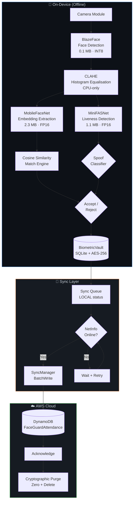
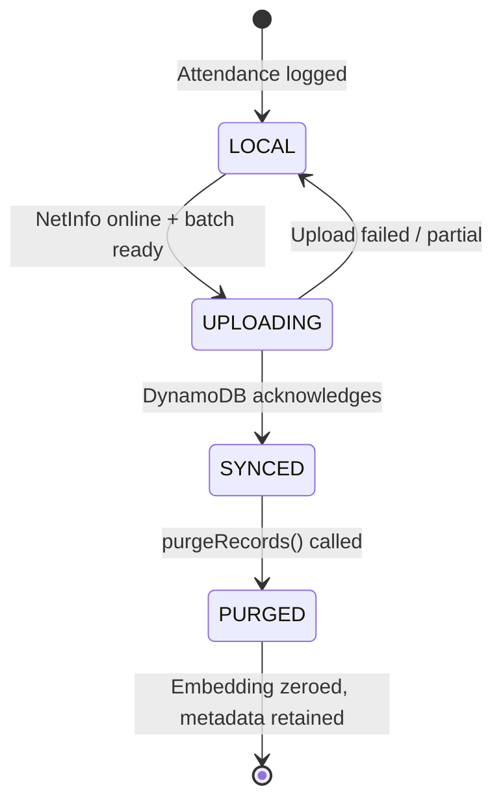
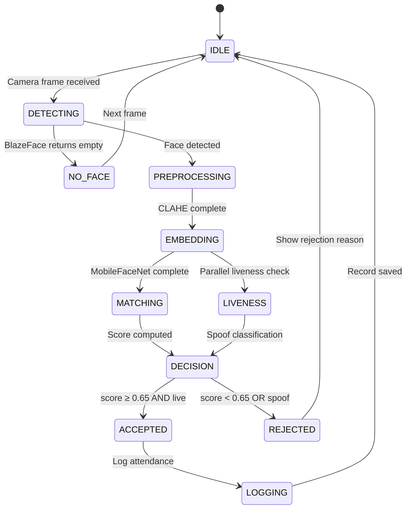
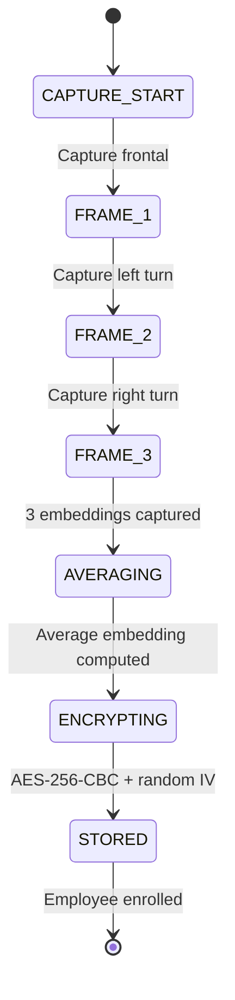

# Architecture

> System design document for FaceGuard Offline — secure on-device biometric authentication.

---

## System Diagram



## Component Descriptions

### Camera Module
Captures frames via `react-native-camera` at 640×480 resolution. Frames are held in memory only — never written to disk. The camera module provides YUV420 frames on Android and BGRA on iOS, with platform-specific conversion to RGB tensors.

### BlazeFace (Face Detection)
Google's single-shot face detector optimised for mobile. Detects face bounding boxes and 6 key landmarks (eyes, nose, mouth, ears) in a single forward pass. The INT8-quantised model runs in < 50ms on budget hardware. If no face is detected, the pipeline short-circuits immediately.

### CLAHE (Preprocessing)
Contrast-Limited Adaptive Histogram Equalisation normalises illumination across the detected face crop. This is a CPU-only operation (no model required) that runs in < 30ms and dramatically improves embedding quality under adverse lighting — low light, backlighting, and uneven illumination.

### MobileFaceNet (Embedding Extraction)
Produces a 128-dimensional L2-normalised embedding vector from the preprocessed face crop. The architecture uses Global Depthwise Convolution for compact feature extraction. FP16-quantised for optimal accuracy-speed tradeoff on mobile NPUs.

### MiniFASNet (Liveness Detection)
Face Anti-Spoofing Network that classifies input as live, printed photo, or screen replay. Analyses depth map estimation, moiré patterns, and texture features. Returns three scores: `liveScore`, `depthScore`, and `moireScore`.

### Cosine Similarity Match Engine
Pure TypeScript implementation. Computes cosine similarity between the probe embedding and all enrolled gallery embeddings. Threshold: 0.65. Linear scan is sufficient — matching 100 employees completes in < 5ms.

### BiometricVault
Encrypted SQLite database with four tables:

| Table | Purpose |
|-------|---------|
| `employees` | Identity metadata (name, department, created_at) |
| `embeddings` | AES-256-CBC encrypted embedding vectors + IV |
| `attendance` | Timestamped check-in/check-out records |
| `sync_queue` | Upload queue with LOCAL/SYNCED status |

### SyncManager
Manages the offline-first sync lifecycle. Monitors connectivity via `@react-native-community/netinfo`, batches records (max 25 per DynamoDB BatchWrite), handles partial failures with retry, and triggers cryptographic purge only after confirmed server acknowledgment.

---

## Data Flow

```
Camera Frame (RGB, 640×480, in-memory only)
    │
    ▼
BlazeFace Detection ──→ No face? → EXIT (no data persisted)
    │
    ▼ Face crop (112×112)
    │
    ├──→ CLAHE Equalisation ──→ MobileFaceNet ──→ 128-d embedding
    │                                                    │
    │                                                    ▼
    │                                          Cosine Match vs Gallery
    │                                                    │
    │                                          score ≥ 0.65? ──→ No → REJECT
    │                                                    │
    └──→ MiniFASNet Liveness ──→ live? ──→ No → REJECT (spoof detected)
                                   │
                                   ▼
                           ACCEPT: log attendance
                                   │
                                   ▼
                    BiometricVault.logAttendance()
                    (encrypted, status: LOCAL)
```

---

## Security Architecture

### Key Derivation

```
Hardware Device ID (unique per device)
         │
         ▼
    PBKDF2-HMAC-SHA512
    iterations: 100,000
    salt: app-specific constant + siteCode
         │
         ▼
    256-bit AES key (device-bound)
```

### Encryption Flow

```
Raw embedding (128 × float32 = 512 bytes)
         │
         ▼
    JSON.stringify → plaintext bytes
         │
         ▼
    Generate random IV (16 bytes, crypto.getRandomValues)
         │
         ▼
    AES-256-CBC encrypt (key, IV, plaintext)
         │
         ▼
    Store: { ciphertext: base64, iv: base64 }
```

### Embedding Privacy

Embeddings are 128-dimensional unit vectors in a learned feature space. They are:
- **Non-invertible** — No known method to reconstruct a face image from 128 floats
- **Non-linkable** — Different models produce incompatible embedding spaces
- **Encrypted at rest** — AES-256-CBC with per-record random IV
- **Purged after sync** — Overwritten with zeros, then row deleted

---

## Sync Architecture



---

## State Machine: Recognition Flow



## State Machine: Enrolment Flow



---

## Technology Choices

| Component | Choice | Justification |
|-----------|--------|---------------|
| Runtime | React Native 0.73 | Cross-platform from single codebase; existing NHAI app ecosystem |
| ML Runtime | TensorFlow Lite | Best mobile inference performance; INT8/FP16 quantisation support |
| Face Detection | BlazeFace | 0.1 MB model; real-time on low-end devices; MIT-compatible |
| Face Embedding | MobileFaceNet | 2.3 MB; 99.2% LFW accuracy; designed for mobile deployment |
| Liveness | MiniFASNet | Multi-modal anti-spoofing; depth + moiré + texture in 1.1 MB |
| Local DB | SQLite (react-native-sqlite-storage) | Zero-config, embedded, battle-tested; supports in-process encryption |
| Encryption | AES-256-CBC via Node crypto | Industry standard; FIPS 140-2 compliant algorithm |
| Key Derivation | PBKDF2-HMAC-SHA512 | NIST SP 800-132 recommended; 100k iterations for mobile |
| Cloud Sync | AWS DynamoDB | Serverless, auto-scaling; BatchWrite for efficient uploads |
| Background Sync | react-native-background-fetch | Cross-platform periodic task execution; iOS + Android |
| Connectivity | @react-native-community/netinfo | De-facto standard for network state monitoring in RN |
